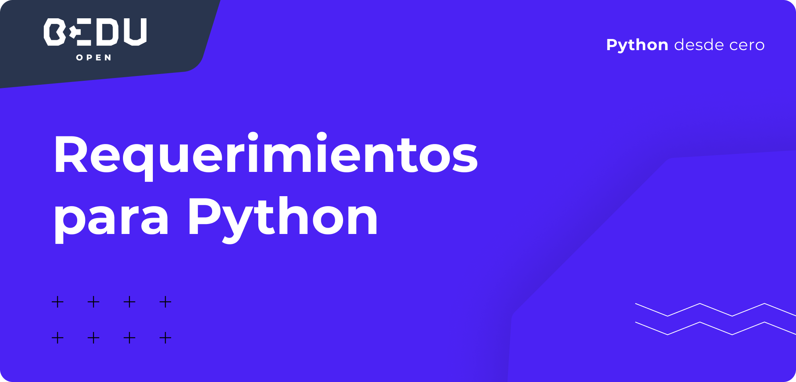
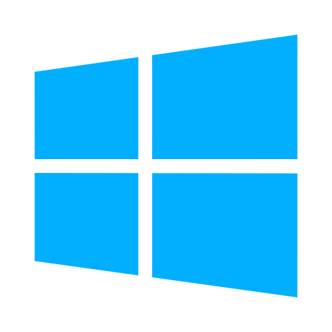

# Requerimientos para Python

### 👩💻 **Requerimientos**

Puedes desarrollar en Python en cualquier Sistema Operativo, ya sea **Mac**, **Linux** o **Windows**. Recomendamos el uso de sistemas operativos basados en **UNIX** \(**Mac** o **Linux**\).

Durante el desarrollo de este curso, será necesario tengas instalados en tu computadora un editor de texto \(Recomendamos **Visual Studio Code**\) y **Python**.

En los sistemas operativos **Mac** y **Linux** ya se encuentra instalado en el sistema, pero para descargar la versión más actual incluyendo **Windows** se puede realizar por medio del siguiente recurso



### **Editor de texto recomendado**

>  **Visual Studio Code** 
>
> **Selecciona la descarga de Visual Studio Code dependiendo de tu sistema operativo:**
>
> \*\*\*\* **Windows:**
>
> * **Windows** de ****[**64 bit**](https://code.visualstudio.com/docs/?dv=win64user)
> * **Windows** de ****[**32 bit**](https://code.visualstudio.com/docs/?dv=win32user)
>
> \*\*\*\* **Mac:**
>
> * Descarga de Visual Studio Code ****para ****[**Mac**](https://code.visualstudio.com/docs/?dv=osx)
>
> \*\*\*\* **Linux:**
>
> * **Linux:** [**\(Debian, Ubuntu\)**](https://code.visualstudio.com/docs/?dv=linux64_deb)
> * **Linux:** [**\(Red Hat, Fedora, SUSE\)**](https://code.visualstudio.com/docs/?dv=linux64_rpm)
>
> **Es importante que tu computadora cumpla con los siguientes requerimientos para instalar Visual Studio Code:**
>
> * **Sistema Operativo Mínimo:** 
>
>   * Windows 7
>   * OS X Yosemite o superior
>   * Ubuntu 14.04 o Debian 7
>   * Red Hat 7, CentOS7, Fedora 23
>
>   \*\*\*\*
>
> * **Velocidad mínima de Procesador:** 1.6Ghz
> * **Memoria RAM mínima:** 1Gb

### **Manual de Instalación de Python 3 en Mac**

**OS X** viene con un gran número de utilidades de desarrollo y es posible trabajar con **Python** sin instalar software adicional, pero generalmente cuenta con la **versión 2.7** que actualmente se encuentra sin soporte.

Para instalar la versión más actual en OS X será necesario instalar xCode desde la App Store



Una vez descargado será necesario abrir la terminal y ejecutar el siguiente comando: ****`xcode-select --install`

Una vez termine la ejecución del comando será necesario instalar **Homebrew** por medio del siguiente comando: `$ ruby -e "$(curl -fsSL https://raw.githubusercontent.com/Homebrew/install/master/install)"`

Una vez termine la descarga de **brew** en nuestro sistema podemos instalar Python 3 con el siguiente comando: `brew install python3`

Una vez termine de ejecutarse el comando, tendremos instalado **python 3** en nuestro sistema, para verificar la instalación fue exitosa ejecutamos el siguiente comando: `python3`

### **Manual de Instalación de Python 3 en Windows**

Primero debemos **descargar** la última versión de Python desde el sitio oficial, en el siguiente link podrás encontrar las opciones de descarga:



Una vez descargado el instalador lo ejecutamos y veremos la siguiente pantalla, donde **activaremos** **la** **casilla** **Add Python Path** y realizaremos click en la leyenda **Install Now**

Una vez termine la instalación veremos la siguiente pantalla

En nuestro buscador del sistema operativo **buscaremos** **Python** y encontraremos la **app** a **ejecutar**, realizaremos click y tendremos en pantalla la siguiente terminal 

Una vez instalado todos los requerimientos del curso es **momento de iniciar con el primer tema.**

