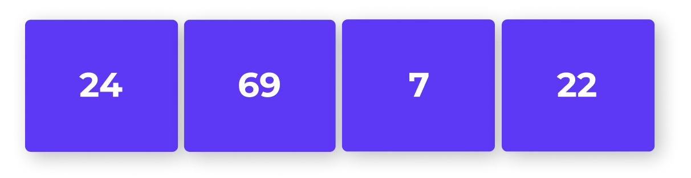

# ¿Qué es una lista?

### **¿Qué es una lista?**

Una lista es una estructura de datos, pero ahora te estarás preguntando **¿qué es, para qué y cómo funciona exactamente las estructuras de datos?.**

Las estructuras de datos son esenciales para todas las personas que desean trabajar con software.

Cuando se trata de la estructura de datos de una lista, debemos mencionar que define un conjunto secuenciales de elementos a los que se puede agregar nuevos elementos y eliminar los existentes.

Pero esto no significa que sea el límite de elementos disponibles, ya que este tipo de estructuras nos permite crecer tanto como sea necesario, en comparación con la matriz estática clásica que no puede cambiar de tamaño ya que cuentan con una ya definido.

Una de las mayores ventajas del uso de listas es el ahorro en memoria y uso de la CPU, ya que únicamente se utiliza el tamaño que se encuentra en uso. 

Las listas tienen diferentes usos y aplicaciones, la necesidad más obvia es cuando tienes que almacenar diversos artículos sin saber cuánto espacio necesitarás; 

**Por ejemplo** una lista de super:

### **Operaciones Principales**

Como ya lo mencionamos anteriormente las lista nos permiten agregar y eliminar elementos, pero cómo funciona realmente estas operaciones.

Primero observaremos en la siguiente imagen una lista con un tamaño de 4 elementos y una capacidad de 4.

Si nosotros queremos agregar un nuevo elemento con el método `.append( )` como lo vimos en el vídeo, se activará un mecanismo de cambio de tamaño, en la imagen de abajo podremos ver como la lista agrego un nuevo elemento \(el número 6\), pero además reservó un espacio de lista del doble de capacidad, a esta operación se le conoce como desbordamiento de capacidad, pero el tamaño real de nuestra lista será de 5 elementos.

Si bien agregar elementos en una lista puede ser una operación que se ejecuta de forma rápida, eliminar elementos es una operación más lenta y esto se debe a que cuando se elimina un elemento, para preservar la continuidad de la estructura debe reemplazar todos los elementos a su nueva ubicación, por ejemplo si tuviéramos 3 elementos después del número 6 y eliminamos este número, los 3 siguientes elementos tendrían que recorrer una posición a la izquierda.

### **¿Qué es una tupla y cual es la diferencia con las listas?**

Una **tupla** es una secuencia de valores muy parecida a una lista, similar a las listas valores almacenados en una tupla pueden ser de cualquier tipo y estás indexeados por enteros, pero lo que las diferencia es que las tuplas son inmutables, por lo que no podremos modificar sus elementos que contiene, pero como beneficio tiene la ventaja de ser más rápida al tener un espacio definido en memoria.

Una de las aplicaciones en las que podemos usar tuplas es para almacenar fechas o información que sabemos no vamos a cambiar como es el caso de direcciones o nombres y apellidos.

**`(25, "Mayo", 1810)`**

Debemos recordar que podemos anidar tuplas dentro de tuplas e incluso dentro de listas; en el siguiente ejemplo veremos dos tuplas separadas que se pueden relacionar en una misma

**`tupla1 = ("Juan", "Gomez")`**

**`tupla2 = ("Programación")`**

**`lista = ['tupla1','tupla2']`**  

