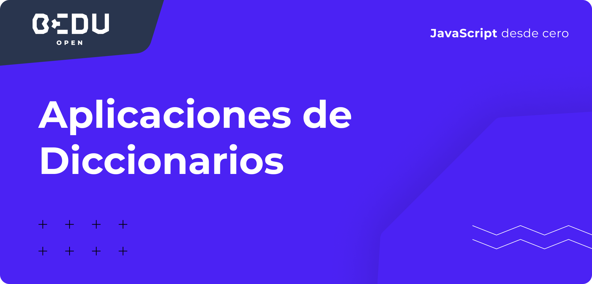

# Introducción



**Es momento de revisar el vídeo Diccionarios Python.**






\*\*\*\*🧙♀ **Crea un diccionario con 5 llaves y valores**

1. Realiza el método correspondiente que regrese cuántos elementos contiene el diccionario

2. Agrega una Sexta llave y valor al diccionario

3. Elimina un elemento del diccionario original

4. Imprime todas las llaves del diccionario

5. Pregunta por la existencia de una llave

6. Pregunta por la inexistencia de una llave

En el archivo **`solucionDiccionarios.py`** encontraras un ejemplo de cómo resolver estos 6 puntos \(Puedes ejecutarlo desde la terminal y ver el resultado\)





\*\*\*\*👨💻 **¡Mira lo que se nos ocurrió, para solucionar el problema!**

Crea un diccionario con 5 llaves y valores

1. Realiza el método correspondiente que regrese cuántos elementos contiene el diccionario

2. Agrega una Sexta llave y valor al diccionario

3. Elimina un elemento del diccionario original

4. Imprime todas las llaves del diccionario

5. Pregunta por la existencia de una llave

6. Pregunta por la inexistencia de una llave


```python
overwatch = {}

overwatch['D.va'] = 'Tanque'
overwatch['Reinhartd'] = 'Tanque'
overwatch['Hanzo'] = 'Daño'
overwatch['Mercy'] = 'Soporte'
overwatch['Moira'] = 'Soporte'

print(overwatch)

#Solución Punto 1
len(overwatch)

#Solución Punto 2
overwatch['Mei'] = 'Daño'
len(overwatch)
print(overwatch)

#Solución Punto 3
del overwatch['Reinhartd']
len(overwatch)
print(overwatch)

#Solución Punto 4
overwatch.keys()

#Solución Punto 5
print('D.va' in overwatch)

#Solución Punto 6
print('Pharah' not in overwatch)
```





